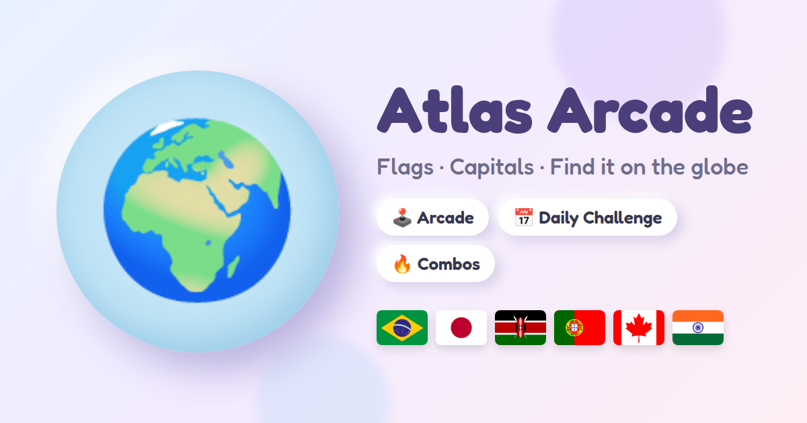

# 🌍 Atlas Arcade

A pastel, arcade-style geography quiz. Name countries from their **flag**, **shape**,
or where they light up on a spinning **globe**; guess **capitals** with a soft region
hint; and **locate** places by tapping the globe (Geoguessr-style, scored by distance).
Answer fast for more points, chain correct answers for a **combo**, and reveal **hints**
when you're stuck (they cost points).

**▶ Play: https://azevedev.github.io/atlas-arcade/**




## Modes
- **Arcade** — 3 lives, endless, difficulty ramps up, local high score.
- **Daily Challenge** — a fixed set of 10, the same for everyone that day (UTC), with a
  shareable emoji grid and a day streak.

Works on mobile, installs as a PWA ("Add to Home Screen"), and plays offline once loaded.
No accounts, no tracking — scores live in your browser's `localStorage`.

## Run it locally

It's a buildless static site, but ES modules + `fetch()` need `http://` (not `file://`):

```bash
cd atlas-arcade
python3 -m http.server 8000
# open http://localhost:8000
```

## Deploy (GitHub Pages)

The repo ships a workflow at `.github/workflows/pages.yml`. In **Settings → Pages**, set
**Source: GitHub Actions** and push to `main` — it publishes the root as-is. All paths are
relative, so it works from a project subpath (`/atlas-arcade/`) with no config. A
`.nojekyll` file is included so Pages serves the files untouched.

## How it's built

Vanilla JS (ES modules) + D3 (orthographic globe) + TopoJSON, all vendored in
`vendor/` so it runs offline. No framework, no build step.

- `src/` — game code (`globe`, `questions`, `engine`, `modes/*`, `ui`, …)
- `sw.js` — service worker (offline + instant repeat loads)
- `assets/data/countries.json` — trimmed country dataset (name, capital, lat/lng, tier)
- `assets/geo/countries-{50m,110m}.json` — country shapes (world-atlas TopoJSON)
- `assets/flags/*.svg` — one flag per country
- `assets/social/*` — Open Graph image + PWA icons
- `assets/fonts/*` — Fredoka + Nunito (variable)

### Regenerating the data

The dataset is produced from open sources (world-atlas, mledoze/countries, Natural
Earth capitals, a population list) and flags from flagcdn:

```bash
python3 scripts/build_data.py   # -> assets/data/countries.json (+ geo)
bash    scripts/fetch_flags.sh  # -> assets/flags/*.svg
```

## Data sources & licenses

Game code is MIT (see [LICENSE](./LICENSE)). Bundled data and assets keep their upstream licenses:

- Shapes: [world-atlas](https://github.com/topojson/world-atlas) (Natural Earth, public domain)
- Country metadata: [mledoze/countries](https://github.com/mledoze/countries) (ODbL)
- Capital coordinates: [Natural Earth](https://www.naturalearthdata.com/) populated places (public domain)
- Flags: [flagcdn.com](https://flagcdn.com)
- Fonts: Fredoka & Nunito (Open Font License)
